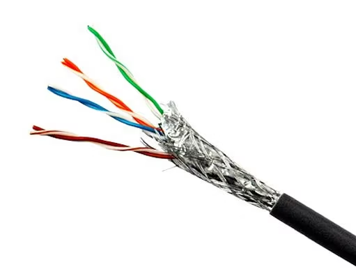
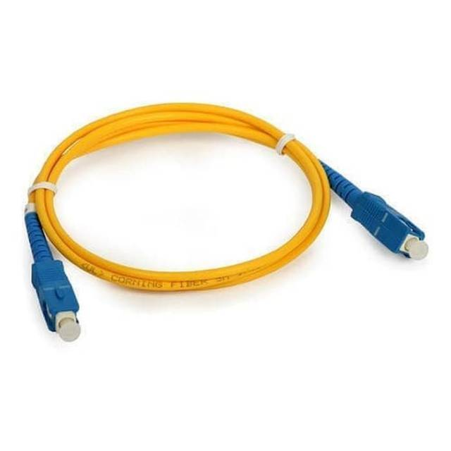

# Mengenal Jenis Kabel: Fungsi dan Karakteristiknya

<!--more-->

Kabel merupakan komponen penting dalam dunia teknik, baik di bidang jaringan komputer, instalasi listrik, maupun sistem audio-video. Setiap jenis kabel memiliki `struktur` dan `fungsi berbeda`, disesuaikan dengan kebutuhan transmisi data, daya listrik, atau sinyal. Artikel ini akan membahas `jenis-jenis kabel paling umum` yang sering digunakan, lengkap dengan fungsi dan karakteristik utamanya.

---

## Kabel Jaringan / Data
Kabel jaringan adalah `media penghantar` yang digunakan untuk mentransmisikan `data` antar perangkat jaringan. Jenis kabel ini umum dijumpai di perkantoran, sekolah, rumah, dan pusat data, terutama dalam jaringan LAN (Local Area Network). Terdapat berbagai jenis kabel jaringan seperti UTP, STP, dan fiber optic, masing-masing memiliki perbedaan dari sisi kecepatan, jangkauan, dan ketahanan terhadap interferensi.

### 1. UTP (Unshielded Twisted Pair)
UTP adalah jenis kabel jaringan yang paling umum digunakan untuk LAN. Disebut `"Unshielded"` karena `tidak memiliki` pelindung tambahan selain isolasi plastik luar.

**Fungsi:** Mentransmisikan data antar perangkat dalam jaringan komputer. 

**Struktur:** Terdiri dari 4 pasang kawat tembaga yang dipilin (twisted) untuk mengurangi interferensi. 

**Karakteristik:** Murah, mudah dipasang, namun lebih rentan terhadap gangguan elektromagnetik. 

**Type paling umum:**  CAT5e, CAT6 dan CAT6A

<small> baca juga : [Perbedaan CAT5e, CAT6 dan CAT6A](index.md) </small>

---
### 2. STP (Shielded Twisted Pair)
STP adalah `versi UTP` yang dilengkapi `pelindung tambahan` untuk menangkal interferensi.

**Fungsi**: Menghubungkan perangkat jaringan di lingkungan yang penuh gangguan sinyal.

**Struktur**: Sama seperti UTP tapi tiap pasang kabel dilapisi foil (shielding).

**Karakteristik:** Lebih stabil dan tahan interferensi, tapi harganya lebih mahal.

---

### 3. Fiber Optik
Fiber optic adalah kabel jaringan yang menggunakan cahaya (bukan listrik) untuk mengirimkan data.

Fungsi: Mengirimkan data dengan kecepatan tinggi dan jarak jauh.

Struktur: Inti kaca/plastik sebagai jalur cahaya, cladding (pemantul cahaya), dan pelindung luar.

Karakteristik: Super cepat, tahan interferensi, cocok untuk koneksi antar gedung, tapi mahal dan lebih rumit pemasangannya.

---
### Fiber Optic

Jenis:
- **Single-mode**: untuk jarak jauh
- **Multi-mode**: untuk jarak menengah

> 🖼️ *Tambahkan gambar kabel fiber optic + jenis konektornya (SC, LC)*

---

## Kabel Listrik

### NYA

- Kabel tunggal berinti tembaga
- Tidak fleksibel, digunakan untuk instalasi tetap
- Umumnya dipasang dalam pipa pelindung

> 🖼️ *Tambahkan gambar kabel NYA*

---

### NYM

- Terdiri dari 2–4 inti tembaga
- Lapisan isolasi ganda (lebih kuat dari NYA)
- Cocok untuk instalasi di dalam bangunan

> 🖼️ *Tambahkan gambar kabel NYM dan potongan dalamnya*

---

### NYY

- Kabel listrik luar ruangan, bisa ditanam langsung di tanah
- Tahan terhadap kelembaban dan kerusakan fisik ringan

> 🖼️ *Tambahkan gambar kabel NYY outdoor*

---

### Kabel Serabut (Flexible)

- Berisi banyak helai tembaga kecil
- Lebih fleksibel daripada kabel tunggal
- Biasa digunakan untuk peralatan rumah tangga dan colokan listrik

> 🖼️ *Tambahkan gambar kabel serabut dan contoh penggunaannya*

---

## Kabel Audio & Video

### RCA
- Kabel analog, digunakan untuk audio dan video
- Warna umum: kuning (video), merah-putih (audio)

### HDMI
- Kabel digital modern, untuk TV, monitor, dan proyektor
- Mendukung resolusi tinggi & suara digital

### VGA
- Kabel video analog dari PC ke monitor
- Masih digunakan di beberapa proyektor/laptop lama

### Jack 3.5mm
- Kabel audio kecil, umum pada headphone & speaker

> 🖼️ *Tambahkan gambar 4 kabel ini berjajar: RCA, HDMI, VGA, Jack 3.5mm*

---

## Kesimpulan

Setiap jenis kabel memiliki struktur dan karakteristik yang berbeda, disesuaikan dengan fungsinya.  
Mulai dari kabel data seperti **UTP dan fiber optic**, kabel listrik seperti **NYA dan NYM**, hingga kabel audio-video seperti **HDMI dan RCA**, semuanya dirancang untuk **tujuan transmisi yang spesifik**.

> Dengan memahami jenis-jenis kabel ini, kamu bisa lebih mengerti dunia instalasi dan teknologi dari sisi paling dasarnya: kabel.

---

