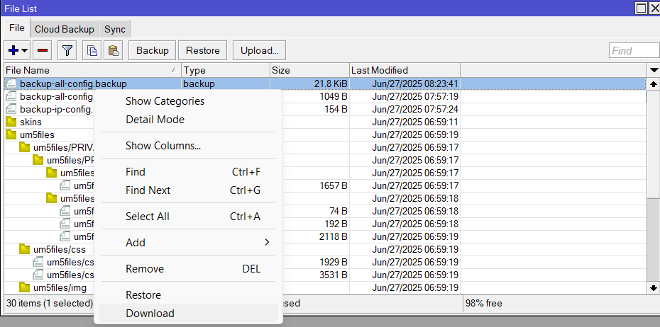

# MikroTik | Backup dan Restore Konfigurasi RouterOS


<!--more-->

Kamu tau ga kalau `backup` ataupun `restore` sistem itu `penting banget` buat ngejaga konfigurasi MikroTik kamu tetap aman. Bayangin aja kalau router tiba-tiba error, ke-reset, atau harus ganti perangkat tanpa backup, semua setting yang udah kamu buat bisa `hilang` begitu aja.

Dengan fitur ini, kamu bisa `menyimpan` semua konfigurasi penting dan `mengembalikannya` kapan aja. Cocok banget buat jaga-jaga sebelum `upgrade` firmware, `reset` router, atau sekadar `clone` konfigurasi ke perangkat lain.

---
## Kenapa Backup Itu Penting?
Sebelum masuk ke teknis, coba kita pahami dulu. Backup itu semacam `safety net`. Kalau suatu saat router kamu error, kena virus, atau mau upgrade perangkat, kamu nggak perlu ngulang semua konfigurasi dari awal. Tinggal `restore`, dan router langsung balik seperti `sebelumnya`.

---
### Jenis Backup di MikroTik
MikroTik menyediakan `dua` metode utama untuk menyimpan konfigurasi: <br>
**1. Backup File (.backup)** <br>
Format ini menyimpan semua konfigurasi, termasuk `password` dan `user`. File ini hanya `bisa digunakan `di perangkat MikroTik yang `sama persis` (terutama dari segi versi dan model).
  - Tidak dapat dibaca text editor.

  - Membackup keseluruhan konfigurasi router.
  - Create return point (dapat kembali seperti semula).
  - Jika restore menggunakan .backup, semua config akan `terhapus dan diganti` dengan config .backup.

**2. Export/Script File (.rsc)**
Ini menyimpan konfigurasi dalam bentuk `script`. Cocok kalau kamu mau `migrasi` setting ke perangkat MikroTik lain, atau mau simpan settingan dengan lebih fleksibel.
  - Berupa script, dapat dibaca dengan text editor.

  - Dapat membackup sebagian atau keseluruhan konfigurasi router.
  - Tidak mengembalikan ke konfigurasi seperti semula, melainkan menambahkan script tertentu pada konfigurasi utama.
  - Jika resotre menggunakan .src semua config akan `ditimpa` dengan config .src, pastikan config sebelumnya dihapus untuk menghindari eror konfigurasi.

<br>

---
## Cara Backup Konfigurasi Mikrotik
Saat melakukan backup, terdapat 2 cara yaitu menggunakan `Terminal` dan Menu `Files > File`.

### Backup via Menu Files > File
Saat melakukan backup lewat menu ini, kamu hanya dapat melakukan backup dengan format `.backup`.


- Kamu dapat klik menu `Backup` dan isi `nama` file backup dan `password` jika perlu.
- File akan otomatis tersimpan di `penyimpanan internal` router mikrotik dengan format `.backup`.


### Backup via Terminal
Dengan menggunakan terminal kamu `dapat` melakukan backup dengan format `.src` maupun `.backup`. Backup dapat dilakukan dengan cara



Dengan melakukan ini semua config akan tersimpan.
```
export file=nama-file
```
Tambahkan *`/bagian-backup export` file=nama-file* | Jika hanya ingin backup config tertentu. Contoh:
```
/ip address export file=nama-file
```



Dengan melakukan ini semua config akan tersimpan.
```
/system backup save name=nama-file
```



**File nya ada dimana banggg??** File akan otomatis tersimpan di penyimpanan internal router, tepatnya di Menu `Files > File`.


<br>

---
## Cara Restore Konfigurasi Mikrotik
Kamu dapat melakukan dapat melakukan restore dengan `2` cara, yaitu via `terminal` (khusus .src) atau menu `Files > File` (khusus .backup). Tapi supaya lebih mudah, kita gunakan Menu dari `Files > File` aja ya ges ya, sama aja kok..! Cukup gunakan `upload` untuk `memasukan file backup` dan `restore` untuk `mengembalikan` config baru.



1. **Backup** <br>
`Fungsi`: Menyimpan seluruh konfigurasi router saat ini ke dalam file .backup.

2. **Restore** <br>
`Fungsi:` Untuk mengembalikan konfigurasi router dari file .backup maupun .src yang sebelumnya sudah ada. <br>
`Cara pakai:` <br>
    - Pastikan file .backup dan atau .src sudah ada di list file (upload dulu kalau perlu).

    - Pilih file .backup dan atau .src, lalu klik tombol Restore.
    - Router akan restart otomatis, dan semua setting akan kembali seperti isi file backup tersebut.
    - Semua konfigurasi yang ada sekarang akan dihapus/ditimpa dan diganti total dengan isi file backup.

3. **Upload** <br>
`Fungsi`: Untuk mengirim file dari komputer ke MikroTik, biasanya file .backup, .rsc, script, atau file lain. <br>
`Cara pakai:` <br>
    - Klik tombol Upload
    
    - Pilih file dari komputermu (misalnya config-ku.rsc)
    - File akan muncul di list Files di MikroTik


<br>

---
## Cara Download File Backup (.backup / .src)
Mudahhh, buka Menu `Files > File` lalu `klik kanan `file yang mau di download dan pilih download.


<br>

---
## PENUTUP
Nah, itu dia pembahasan mengenai `backup` dan `restore` konfigurasi MikroTik. Intinya, backup itu ibarat `sabuk pengaman`, mungkin kamu jarang pakai, tapi bakal `sangat ngebantu` waktu terjadi hal-hal yang gak diinginkan. Daripada nanti harus setting ulang dari nol, mending siapin backup dari sekarang. Gampang banget kok, cuma butuh beberapa baris perintah atau klik-klik di Winbox.

Dan jangan lupa, selalu `simpan file` backup/export kamu di tempat yang `aman`, seperti di laptop, flashdisk, atau cloud storage. Karena file-nya `tidak otomatis tersimpan` di komputer, melainkan di `dalam router`. 

<br>

<p align="center"><strong>Yoo segitu aja gais. Sampai jumpa di artikel selanjutnya iyes..!</strong></p>

---
