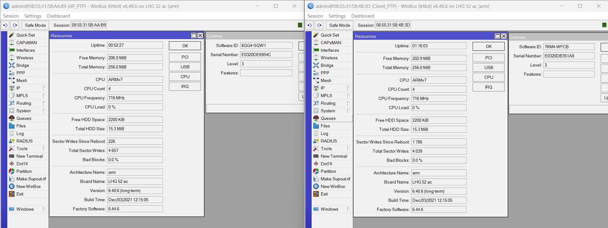
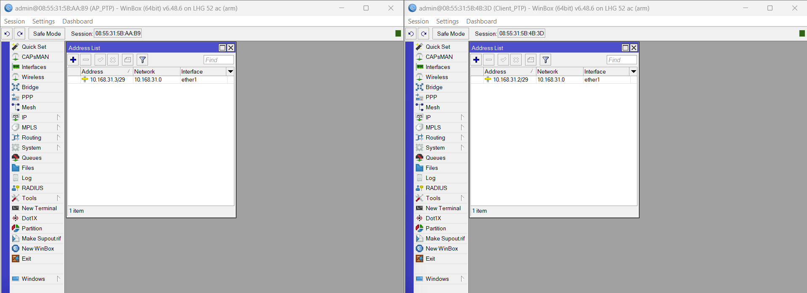
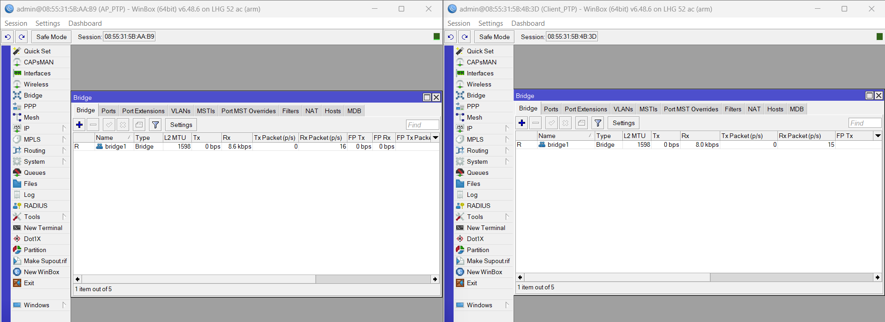
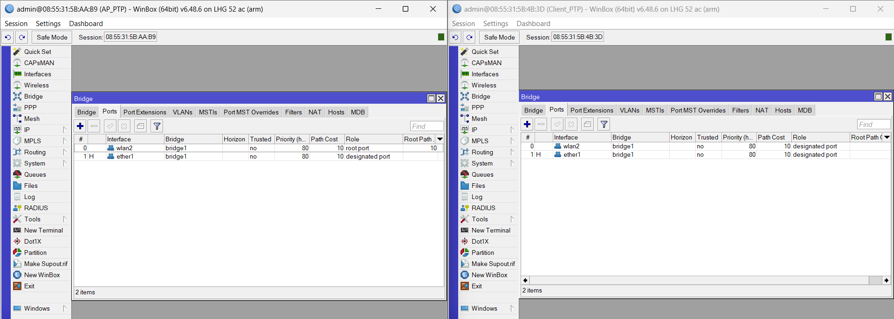
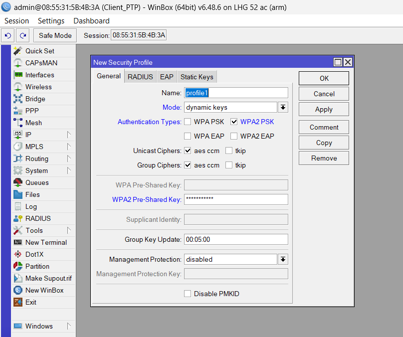
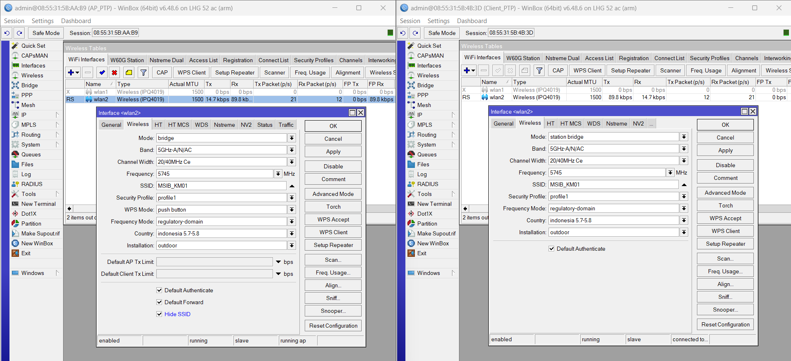
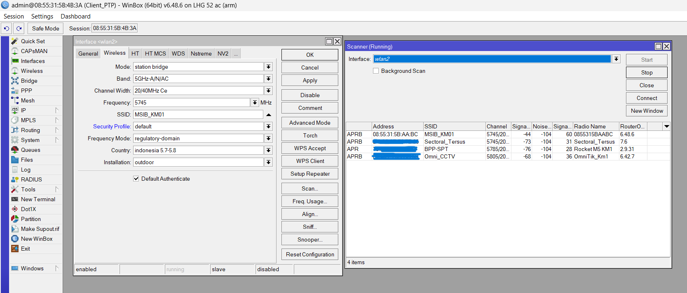
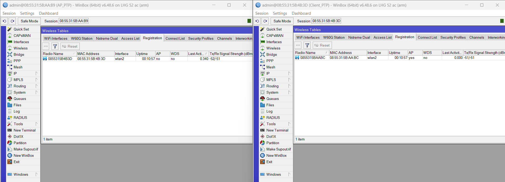

# Mikrotik | Konfigurasi PtP LHG XL 52 ac Sebagai AP dan Client

Artikel ini membahas langkah-langkah konfigurasi perangkat MikroTik LHG XL 52 ac dalam mode Point to Point (PtP), di mana satu perangkat disetel sebagai Access Point (AP) dan satu lagi sebagai Client (Station). Panduan ini cocok untuk menghubungkan dua lokasi berbeda menggunakan jaringan wireless jarak jauh dengan koneksi yang stabil dan efisien.
<!--more-->

- `Access Point (AP)` merupakan perangkat PtP yang `mengirim` sinyal/koneksi.
- `Client` merupakan perangkat PtP yang `menerima` sinyal/koneksi.


 

---

## Konfigurasi Access Point dan Client
### Resources and License

### Login
1. Pada masing-masing perangkat login `via MAC Address` dengan default `IP 192.168.88.11` dengan `password "kosong"` menggunakan Winbox. Jika IP sudah pernah di setting sebelumnya, lakukan `Reset` perangkat baik itu melalui winbox ataupun perangkat.

---
### Set IP Address
2. Set IP Address pada masing-masing perangkat (AP & Client).


- Gunakan `IP address` yang `satu subnet` antara AP dan Client (misalnya 10.168.31.3/29 dan 10.168.31.3/29).
- Jangan sampai ada IP yang duplikat.


---
### Set Bridge
3. Set bridge `"Bridge > + > (nama-bridge) > Apply + Ok"`. 

4. Setelah membuat bridge, masukan port mana yang ingin disatukan. Hal ini dibutuhkan agar `Ethernet (x)` dan `Wireless (wlan)` berada dalam `satu jaringan Layer 2`. Semua perangkat di jaringan (baik LAN maupun yang terhubung via wireless) bisa saling broadcast ARP, DHCP, dan lain-lain. Juga kita bisa relay koneksi dari AP ke Client atau sebaliknya (seperti kabel virtual).


- `Jangan bridge semua interface` sembarangan (misal ether1 dengan ether2, dll) bisa terjadi `loop` atau `broadcast storm`. Cukup `port` yang ingin dijadikan `satu` (contoh `ether1` dan `wlan 1`).
- Jika tidak memasukkan interface ke bridge, maka koneksi wireless tidak akan bisa meneruskan jaringan ke port LAN.


---
### Set Wireless > Security Profiles
5. Security profile pada MikroTik berfungsi untuk `mengamankan koneksi` wireless antara perangkat AP dan Client. Tanpa konfigurasi security profile yang benar, koneksi wireless akan terbuka dan sangat rentan terhadap:
    - penyusupan Penyusupan (unauthorized access)
    - Sniffing data (penyadapan trafik)
    - Serangan man-in-the-middle
    - Koneksi liar dari perangkat lain yang melihat SSID kita

    Disini, kita bisa setel:
    - Mode Keamanan --> dynamic-keys
    - Jenis otentikasi --> wpa2-psk
    - Pre-shared key --> isi password seperti WiFi  


- Jangan gunakan password lemah seperti 12345678 atau password.
- Jangan biarkan SSID aktif tanpa security — ini seperti membiarkan kabel LAN tergeletak di jalan.
- Gunakan WPA2-PSK minimal, karena metode ini masih aman dan kompatibel untuk PtP MikroTik.


---
### Set Wireless (wlan)
6. Pada bagian ini, kita akan mengatur interface wireless pada perangkat MikroTik LHG XL 52 ac agar dapat terkoneksi dalam mode Point to Point (PtP). Salah satu perangkat akan diset sebagai Access Point (AP), dan satu lagi sebagai Client (Station).
  Pengaturan ini meliputi:
    - Mode wireless (bridge & station-bridge)
    - SSID dan Frequency
    - Bandwidth channel (Channel Width)
    - Pengamanan jaringan (Security Profile)

    Konfigurasi yang tepat akan memastikan kedua perangkat dapat berkomunikasi stabil dan aman, serta memungkinkan jaringan LAN di kedua sisi saling terhubung layaknya memakai kabel.
    

    > **Detail Pengaturan Konfigurasi `AP` (Foto Kiri)** 
    | Opsi                     | Nilai               | Penjelasan                                                        |
    | ------------------------ | ------------------- | ----------------------------------------------------------------- |
    | **Mode**                 | `bridge`            | Mode ini digunakan oleh AP agar bisa jadi pusat koneksi wireless. |
    | **Band**                 | `5GHz-A/N/AC`       | Mengaktifkan support untuk perangkat 5GHz, baik A, N, maupun AC.  |
    | **Channel Width**        | `20/40MHz Ce`       | Lebar kanal, Ce artinya C = central freq, e = extension ke atas.  |
    | **Frequency**            | `5745 MHz`          | Frekuensi yang digunakan. Harus sama dengan client.               |
    | **SSID**                 | `MSIB_KM01`         | Nama jaringan wireless. Harus sama dengan client.                 |
    | **Security Profile**     | `profile1`          | Mengatur keamanan (WPA2, password). Wajib cocok dengan client.    |
    | **WPS Mode**             | `push button`       | Fitur pairing WPS. Biasanya tidak diperlukan di PtP.              |
    | **Frequency Mode**       | `regulatory-domain` | Menyesuaikan frekuensi legal di Indonesia.                        |
    | **Country**              | `indonesia 5.7-5.8` | Hanya memperbolehkan frekuensi sesuai aturan Indonesia.           |
    | **Installation**         | `outdoor`           | Menginformasikan RouterOS bahwa perangkat dipasang luar ruangan.  |
    | **Default Authenticate** | ✔️                  | Mengizinkan perangkat untuk mengotentikasi otomatis.              |
    | **Default Forward**      | ✔️                  | Mengizinkan bridge traffic dari client ke jaringan LAN.           |
    | **Hide SSID**            | ✔️                  | Menyembunyikan SSID agar tidak terlihat publik (lebih aman).      |

    > **Detail Pengaturan Konfigurasi `Client` (Foto Kanan)** 
    | Opsi                     | Nilai               | Penjelasan                                                   |
    | ------------------------ | ------------------- | ------------------------------------------------------------ |
    | **Mode**                 | `station bridge`    | Mode ini digunakan untuk client agar bisa **bridge** ke AP.  |
    | **Band**                 | `5GHz-A/N/AC`       | Harus sama dengan AP.                                        |
    | **Channel Width**        | `20/40MHz Ce`       | Sama seperti AP, wajib disamakan.                            |
    | **Frequency**            | `5745 MHz`          | Harus identik dengan AP agar bisa terkoneksi.                |
    | **SSID**                 | `MSIB_KM01`         | Harus sama dengan AP (huruf besar/kecil juga penting).       |
    | **Security Profile**     | `profile1`          | Harus identik dengan AP (terutama password WPA2).            |
    | **Frequency Mode**       | `regulatory-domain` | Sama seperti AP, untuk mengikuti aturan lokal.               |
    | **Country**              | `indonesia 5.7-5.8` | Menyesuaikan spektrum frekuensi legal.                       |
    | **Installation**         | `outdoor`           | Disesuaikan dengan penggunaan lapangan.                      |
    | **Default Authenticate** | ✔️                  | Agar perangkat langsung mencoba konek ke SSID yang dikenali. |

---
### Scan Jaringan Pada Client
Fitur scan hanya digunakan pada client saja, untuk mendeteksi jaringan wireless (SSID) di sekitar. Caranya, masuk menu `Wireless > Interfaces wlan2 > tombol "Scan..."` Setelah SSID ditemukan, klik `Connect`. 

---
### Cek Koneksi (Registrasi Wireless)
Lihat pada menu `Wireless > Registration`, jika terdapat data seperti gambar dibawah ini maka menunjukkan bahwa koneksi wireless PtP telah berhasil terjalin antara perangkat Access Point (AP) dan Client (Station). Hal ini biasanya ditandai oleh:
  - Munculnya informasi `MAC Address` perangkat lawan pada tab Registration.
  - Status `Uptime` berjalan stabil (10+ menit).
  - Koneksi dua arah terlihat dari nilai `Tx/Rx Signal Strength` sekitar -51 dBm → menandakan sinyal kuat dan stabil.
  - AP mendeteksi Client, dan sebaliknya Client mendeteksi AP.

---
## Kesimpulan
Konfigurasi Point to Point (PtP) menggunakan perangkat MikroTik LHG XL 52 ac merupakan solusi ideal untuk membangun koneksi jaringan nirkabel jarak jauh yang stabil dan aman.
Dengan mengikuti langkah-langkah seperti:
1. Menentukan `IP Address`
2. Membuat `bridge` dan `mengatur port`
3. Mengonfigurasi `wireless` sebagai `AP` dan Clie`nt, serta
4. Menyesuaikan `security profile` dan `frekuensi`

### Kenapa Ga Set Route dan NAT?
Pada konfigurasi Point to Point menggunakan bridge, jaringan bekerja dalam `Layer 2` (Data Link Layer), bukan Layer 3 (IP Layer). Artinya:
  - Kedua perangkat LHG (AP dan Client) terhubung `seperti` pakai kabel LAN biasa.
  - Semua perangkat yang terhubung ke `salah satu` sisi bisa langsung komunikasi ke sisi lain, selama mereka berada dalam `satu subnet IP`. 

### Jadi Kenapa Ga Perlu Set Route?
  - Routing dibutuhkan jika kita ingin menghubungkan `dua jaringan berbeda` (misal: 192.168.1.0/24 dengan 192.168.2.0/24).
  - Tapi dalam kasus ini, karena kita menggunakan `bridge`, maka cukup `satu subnet saja` (misalnya 10.168.31.0/29) di kedua sisi.
  - Komunikasi langsung, tanpa perlu aturan route tambahan.

### Kenapa Ga Perlu NAT?
NAT (Network Address Translation) `hanya digunakan` saat kita ingin:
  - Mengakses `internet` dengan `satu IP publik` (masquerade).
  - Melindungi jaringan internal dari luar.
  - Tapi pada koneksi PtP seperti ini, kita tidak sedang mengakses internet, melainkan menghubungkan dua sisi LAN secara langsung.

> So, Karena perangkat dihubungkan menggunakan `mode bridge` dan berada dalam satu jaringan/subnet, maka route dan NAT `tidak diperlukan`. Koneksi langsung, cepat, dan sederhana layaknya kabel panjang antar gedung.

